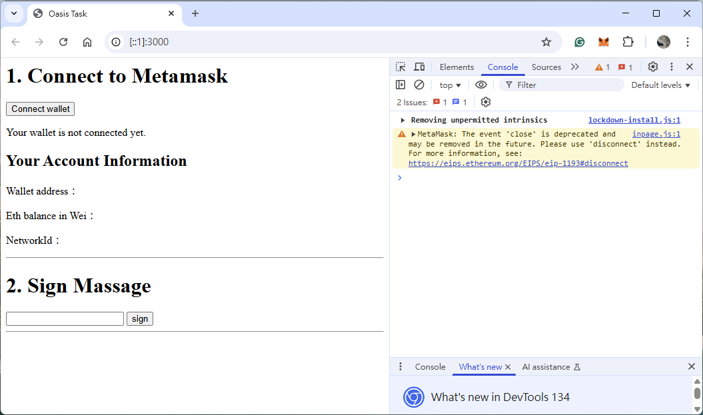
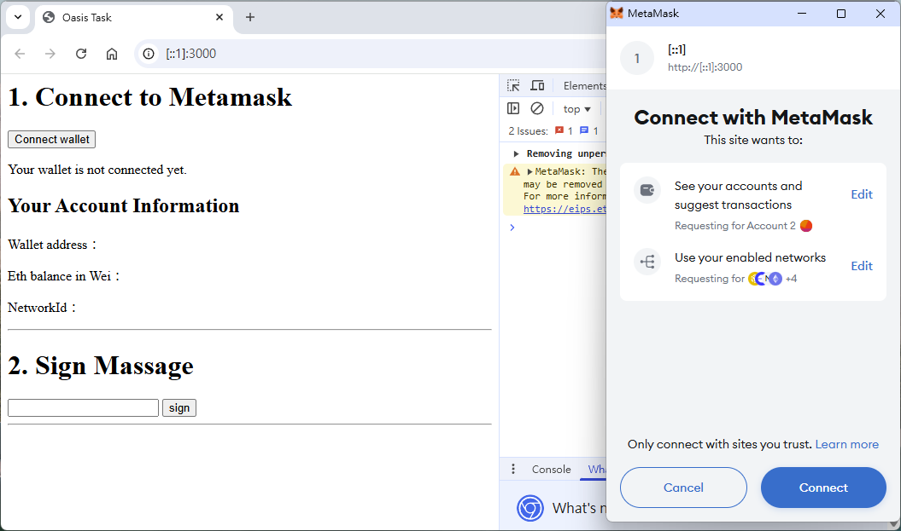
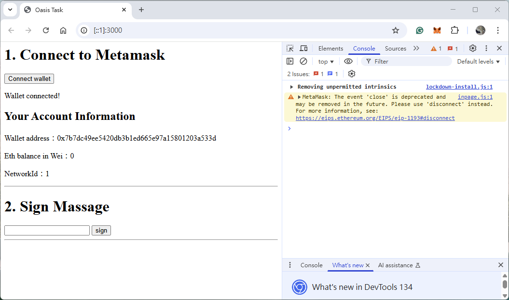
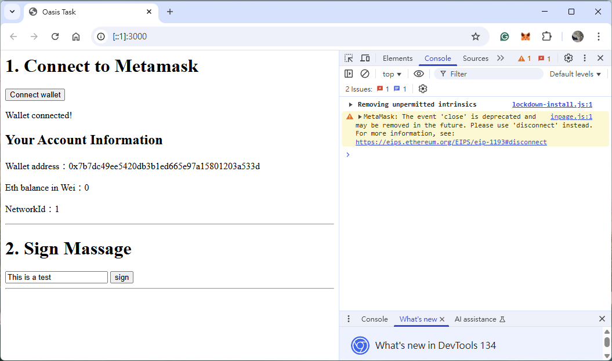
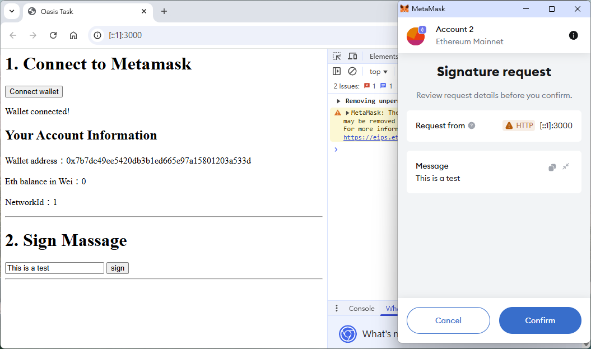
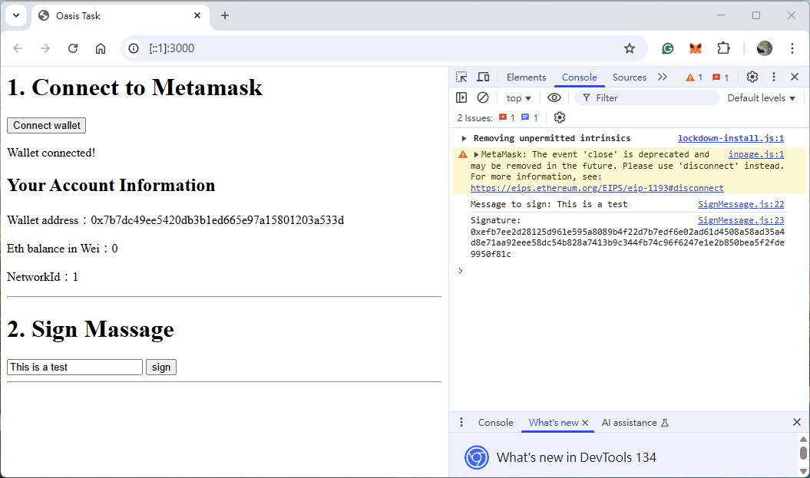

# Running Project Instruction

## Build project

```bash=
npm install
```

## Run project

```bash=
npm run start
```

---

## Screenshots of Process

### Step 1. Connect Wallet

- First page  
  

- Click "Connect wallet"  
  

- After wallet is connected  
  

### Step 2. Sign Message

- Input signing message  
  

- Click "Confirm"  
  

- Message signed and shown in the console  
  
